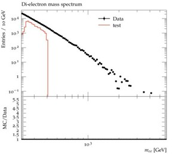
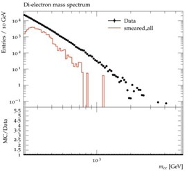

# HEPMC BALER experimentation

HEPMC are text based files for monte carlo event generation data. They are commonly analysed in Rivet or other C++ based analysis programmes. If you would like to set up the C++ workflow instruction can be found in WORKFLOWSETUP.md, although assumes that you are working from CERNs lxplus cluster in the eos folder.

## Overview

We aim to find way's to further compress HEPMC files in a lossy way, an unpacked HEPMC file of 10,000 Drell-Yan events is already 2 GB going down to ~250MB when compressed by common lossless techniques. At 250MB for 10,000 events it can become very resource intensive when wanting to analyse large number of events, and such looking at lossy ccompression to see if it possible to further compress at a small enough loss is the aim.

## Inital experimention

The inital experimentation looked at what Rivet excepts from an incoming HEPMC file, these tests where things such as mass energy conservation and graph structure.

The data used corresponds to simulations of Drell-Yan process in the invariant mass range 250 - 400 GeV found [here](https://opendata.cern/record/160002) specifically the list called  mc16_13TeV_MC_301002_13tev_PowhegPythia8EvtGen_AZNLOCTEQ6L1_DYee_250M400_hepmc_file_index.json specifically HEPMC.43646139._000001.tar.gz.1.  This mass range was chosen as it contains the first bin edge in the Rivet analysis file [ATLAS_2019_I1725190](https://rivet.hepforge.org/analyses/ATLAS_2019_I1725190.html), the only relavent dilepton analysis file for 13TeV events at ATLAS.

## Core analysis

Before we doing any tests we first look at analysis of just the plain untouched file. This can be done using

```bash
rivet -a ATLAS_2019_I1725190 -o base_analysis.yoda HEPMC.43646139._000001.hepmc
rivet-mkhtml base_analysis.yoda
```
and gives the following output (remembering our file is only from 250 - 400 GeV).



## Energy, Mass and Invariant Mass consistancy 

The first test was checking whether or not Rivet requires consistency of energy, mass and invariant mass. This was done through changing the 4 momenta of all particles.

```python
px, py, pz, e = particle.momentum.px, particle.momentum.py, particle.momentum.pz, particle.momentum.e
px_new = px + np.random.normal(0, abs(px) * sigma_p)
py_new = py + np.random.normal(0, abs(py) * sigma_p)
pz_new = pz + np.random.normal(0, abs(pz) * sigma_p)
e_new = e +  np.random.normal(0, abs(e) * sigma_E)
```
Where the sigmas are small such that each componennt is only changed by ~5%.

Using the Rivet work flow

```bash
rivet -a ATLAS_2019_I1725190 -o smeared_plots.yoda HEPMC.43646139._000001.hepmc
rivet-mkhtml smeared_plots.yoda
```


```console

warning:[""]
```

Plot of the result



Here we clearly see there is a differnece in the distributions when the final state 4 momenta is changed, as expected.

## PYhepmc based analysis

Analysis in Rivet is slow, tedious and expects a user to be on system that can make sure of the toolset. It is also doesn't have a very detailed analysis script for the desired process (Drell-Yan).  So a [pyhepmc](https://scikit-hep.org/pyhepmc/) based analysis was setup.

THis can be found in the  final_state_plots.ipynb notebook. 


