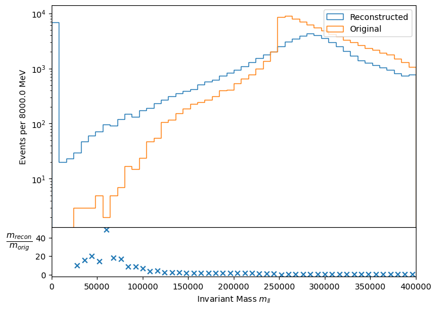
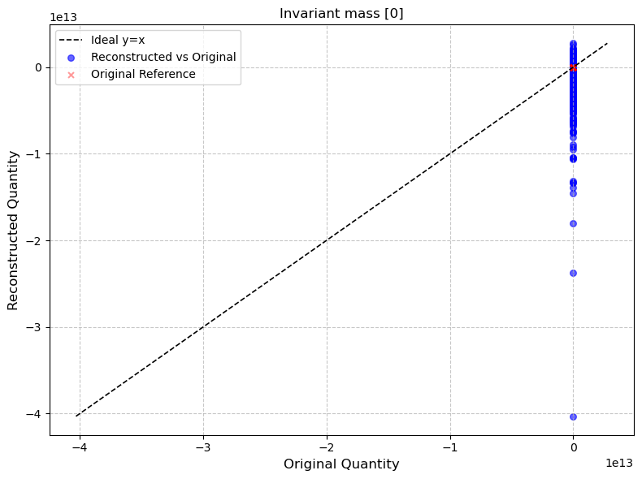

# HEPMC BALER experimentation

HEPMC are text based files for monte carlo event generation data. They are commonly analysed in Rivet or other C++ based analysis programmes. If you would like to set up the C++ workflow instruction can be found in WORKFLOWSETUP.md, although assumes that you are working from CERNs lxplus cluster in the eos folder.

## Overview

We aim to find way's to further compress HEPMC files in a lossy way, an unpacked HEPMC file of 10,000 Drell-Yan events is already 2 GB going down to ~250MB when compressed by common lossless techniques. At 250MB for 10,000 events it can become very resource intensive when wanting to analyse large number of events, and such looking at lossy ccompression to see if it possible to further compress at a small enough loss is the aim.

## Inital experimention

The inital experimentation looked at what Rivet excepts from an incoming HEPMC file, these tests where things such as mass energy conservation and graph structure.

The data used corresponds to simulations of Drell-Yan process in the invariant mass range 250 - 400 GeV found [here](https://opendata.cern/record/160002) specifically the list called  mc16_13TeV_MC_301002_13tev_PowhegPythia8EvtGen_AZNLOCTEQ6L1_DYee_250M400_hepmc_file_index.json specifically HEPMC.43646139._000001.tar.gz.1.  This mass range was chosen as it contains the first bin edge in the Rivet analysis file [ATLAS_2019_I1725190](https://rivet.hepforge.org/analyses/ATLAS_2019_I1725190.html), the only relavent dilepton analysis file for 13TeV events at ATLAS.

## Core analysis

Before we doing any tests we first look at analysis of just the plain untouched file. This can be done using

```bash
rivet -a ATLAS_2019_I1725190 -o base_analysis.yoda HEPMC.43646139._000001.hepmc
rivet-mkhtml base_analysis.yoda
```
and gives the following output (remembering our file is only from 250 - 400 GeV).


## Energy, Mass and Invariant Mass consistancy 

The first test was checking whether or not Rivet requires consistency of energy, mass and invariant mass. This was done through changing the 4 momenta of all particles.

```python
px, py, pz, e = particle.momentum.px, particle.momentum.py, particle.momentum.pz, particle.momentum.e
px_new = px + np.random.normal(0, abs(px) * sigma_p)
py_new = py + np.random.normal(0, abs(py) * sigma_p)
pz_new = pz + np.random.normal(0, abs(pz) * sigma_p)
e_new = e +  np.random.normal(0, abs(e) * sigma_E)
```
Where the sigmas are small such that each componennt is only changed by ~5%.

Using the Rivet work flow

```bash
rivet -a ATLAS_2019_I1725190 -o smeared_plots.yoda HEPMC.43646139._000001.hepmc
rivet-mkhtml smeared_plots.yoda
```


```console

warning:[""]
```

Plot of the result


Here we clearly see there is a differnece in the distributions when the final state 4 momenta is changed, as expected.

## PYhepmc based analysis

Analysis in Rivet is slow, tedious and expects a user to be on system that can make sure of the toolset. It is also doesn't have a very detailed analysis script for the desired process (Drell-Yan).  So a [pyhepmc](https://scikit-hep.org/pyhepmc/) based analysis was setup.

THis can be found in the  final_state_plots.ipynb notebook. The use of this notebook and the scripts it depends on are in [here](scripts/README.md).

## Baler and 4 momenta compression.

Next I moved onto looking at compressing 4 momenta blocks from the final state particles in Baler. All the code for how to get these files and how to evaluate the reconsturction quality are found [here](Notebooks/README.md). 


### The data

For compression to be both succesful and useful a large input dimension space is required, to achieve this I selected N particles from the final state particles, where the N's used where N = 20, 50 and 100.

These correspond to dimension spaces of 80, 200, 400 respectively.

To get these many particles the logic noted in [here](Notebooks/README.md) is used.

The proprocessing of these blocks depends on experiment but the common ones were.

* Standard scaler on px,py and quantile to normal on pz,E.
* Quantile on all
* Transforming into (E, pt, eta, phi) and then quantile scaling.


Quantile scaling was used to ensure they are all distributed the same, although their are definately better methods to be used since this bounds the reconstruction only to values seen in the original data it is trained on.

### Reconstructing (px, py, pz, E) blocks

First I looked at compressing and reconstructing HEPMC's native 4 momenta coordinates, which is in cartesian. This was done in a variety of different preprocessing schemas and different models.

What didn't work was:
    Small models
    Heavy regulisation techniques (in DNN's)
    Min max scaling

The fact that heavy regulursation techniques such as dropout and batchnorm is not suprising given the fact that we are basically trying to overfit the data.

Two main models used were BIGGER_AE and TransformerAE_two, although others were experimented with but were either inconsistent or not as good.

The BIGGER_AE consisted of a symmetric encoder/decoder, with each having 3 hidden layers of size (2048, 512, 256) with the latent size depending on training config. It has Leaky_relu between all layers except on the output layer, such that the output values weren't bounded.

The TransformerAE_two consists of an symmetric encoder/decoder architecture, with the encoder having 3 hidden layers of size (512, 256, 128) and the decoder having 3 hidden layers of size (128, 256, 512) by default, along with a configurable latent dimension of 64. 

## 20 Particle experiments

First we tested with 20 particles (80 features) into a latent space fize of 50 (1.6 compression rate). 

Trained mainly on the BIGGER_AE model.

Small lr needed since large amount of data, (100,000 events) and (80 features). Common used was lr = 10e-4.

Main preprocessing scheme was to convert from MeV -> GeV, then scale px and py's from standard scaling and py, E from quantile into normal distribution.


## 50 Particle experiments
Once we moved onto 50 particles we also decided to look at the cylindrical coordinates to see if this improved the reconstruction of the derived quanities.

How these were obtained can also be found [here](scalingscripts/README.md).

For this we also increased the compression rate, with a latent space size of 64, meaning a 3.125 compression rate.

### Cartesian

First we experimented with compression in cartesian coordiates.

### Cylindrical

This was like a 1/2 day thing so lacks a little rigour and maybe some issues in the way things were calculated.

First I needed to change the proprocessing scheme since working with different distributions.

First we scale to GeV for E and pt. We then $log(1+x)$ scale these distributions.

We then apply quantile to normal to all distributions, this was used as a quick way to sort the fact that $\eta$ and $\phi$ were different distributions and could definately use some more R&D.

The best model for this was the transformer model with the following loss curve. 


The reconstruction quality can be seen here



Although still have poor single particle invariant mass reconstruction




## Main problems seen in reconstruction

The main problem/thing affecting performance was the fact that most of the reconstructed particles we see that $|p| > E$ which we know to be unphysical, this appeared whether I tried cartesian or cylindrical coordinates. The invariant mass of a dilepton system is never going to reconstruct well if the single particle invariant masses can even be reconstructed to a good degree of accuracy. The above problem is seen in the plot of single particle invariant mass squared below. 


## Conclusion

In conclusion I did a sort of feasability study on the compression of HEPMC 4 momenta blocks. There is still a large way to go in area of getting even close to a good enough performance. Although whoever next looks at this work will have massive amounts more time then I had to actually look at the compression as most of the above spanned around 2 weeks of the 8 weeks of my work.


